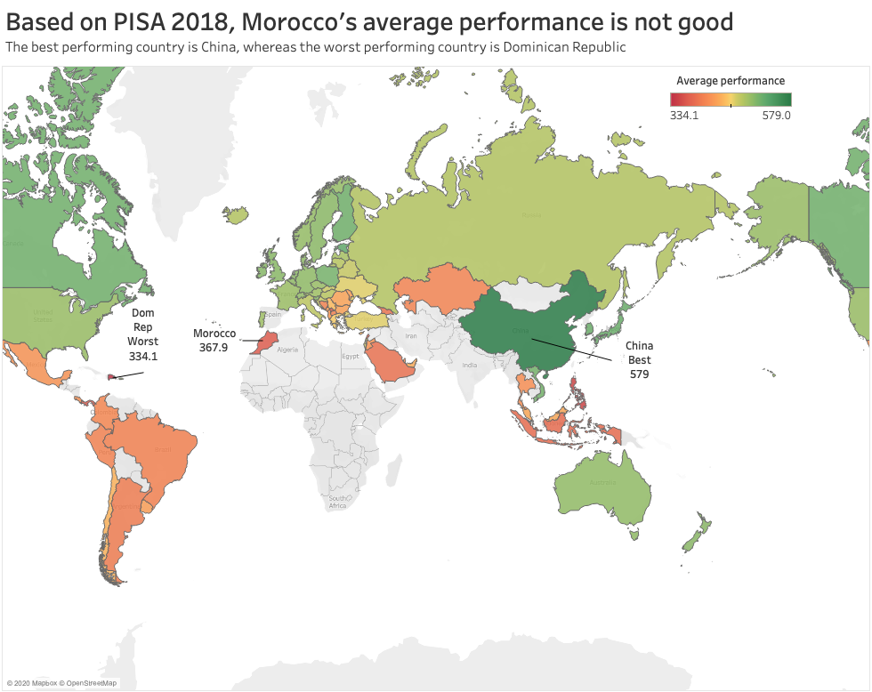
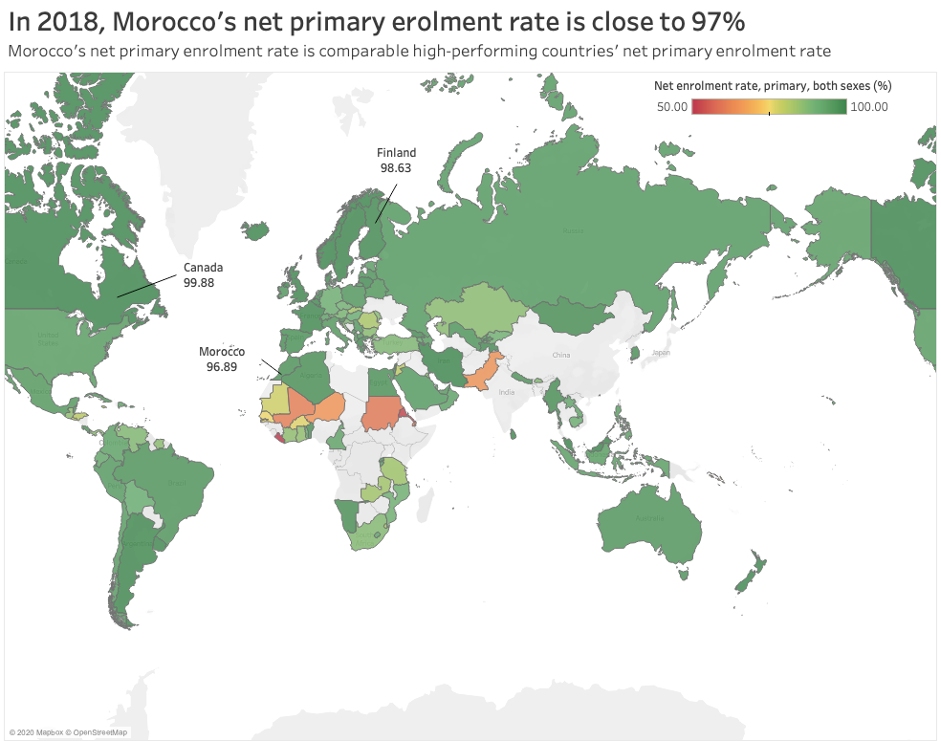

```{r, setup, include=FALSE}
knitr::opts_chunk$set(
  message = FALSE, 
  warning = FALSE, 
  tidy=FALSE,     # display code as typed
  size="small")   # slightly smaller font for code
options(digits = 3)

# default figure size
knitr::opts_chunk$set(
  fig.width=6.75, 
  fig.height=6.75,
  fig.align = "center"
)
```


```{r libraries, include=FALSE}
#Load the corresponding libraries
library(tidyverse)
library(extrafont)
library(vroom)
library(ggtext)
library(gapminder)
library(ggrepel)
library(patchwork)
library(gghighlight)
library(skimr)
library(here)
library(plotly)
library(xlsx)

#remotes::install_github("kjhealy/nycdogs")
library(nycdogs)
library(sf) # for geospatial visualisation

#Windows
#loadfonts(device="win")
#MAC
loadfonts(device="pdf")
```

```{r read in the data}
#Read in the data
userBasedData_raw <- read.csv(file="Morocco.csv",header=TRUE,na.strings=c("..","NA"))
```


```{r Morocco PISA plots}
#Select relevant data for subsequent plots.
Morocco <- userBasedData_raw %>%

#Select data corresponding to X2018..YR2018.
select(Country.Name,Country.Code,Series,X2018..YR2018.)%>%
#Choose the relevant variables.
filter(Series %in% c("PISA: Mean performance on the science scale", "PISA: Mean performance on the reading scale","PISA: Mean performance on the mathematics scale","Youth literacy rate, population 15-24 years, both sexes (%)","GDP at market prices (current US$)	","GDP at market prices (current US$)","Government expenditure on education as % of GDP (%)","Adult literacy rate, population 15+ years, both sexes (%)"))

#Organise the data in a neater way using pivot_wider
Morocco1<-Morocco%>%
  pivot_wider(names_from=Series,values_from=X2018..YR2018.)

#Clean the data corresponding to PISA scores.
Morocco1_PISA<-Morocco1%>%
  #Get only existen non-na values, (i.e. filter out NA values)
  filter(!is.na(`PISA: Mean performance on the science scale`)&!is.na(`PISA: Mean performance on the reading scale`)&!is.na(`PISA: Mean performance on the mathematics scale`))%>%
  #Select PISA performance scores
  select(Country.Name,Country.Code,`PISA: Mean performance on the science scale`,`PISA: Mean performance on the reading scale`,`PISA: Mean performance on the mathematics scale`)%>%
  #Create a new variable Average PISA which is an average of the scores in science, maths and reading
  mutate(AVG_PISA=(`PISA: Mean performance on the science scale`+`PISA: Mean performance on the reading scale`+`PISA: Mean performance on the mathematics scale`)/3)

#Export the data corresponding to PISA scores to excel file.
# Need to load library(xlsx) 
#Uncomment if Excel file is needed
#write.xlsx(Morocco1_PISA, file = "Morocco_PISA.xlsx",
 #     sheetName = "MoroccoPisa", append = FALSE)

#Plot produced with Tableau using the previous Excel file


```


```{r Morocco secondary-primary education}

#Raw data corresponding to primary, secondary education enrolment 
primary_secondary_raw<-read.csv(file="primary_secondary.csv",header=TRUE,na.strings=c("..","NA"))

#SECONDARY NET ENROLMENT 

# Select and filter to obtain the relevant data 
primary_secondary <- primary_secondary_raw %>%
  #Select the relevant data variables
  select(Country.Name,Country.Code,Series,`X2018..YR2018.`) %>%
  #Filter out NA values
   filter(!is.na(X2018..YR2018.)) %>%
  #Choose only data corresponding to secondary net enrolment rate
 filter(Series %in% c("Net enrolment rate, secondary, both sexes (%)"))%>%
  pivot_wider(names_from=Series,values_from=X2018..YR2018.)

# Export the relevant data to file Morocco_net_secondary1.xlsx
# Uncomment if Excel file is needed

# write.xlsx(primary_secondary, file = "Morocco_net_secondary1.xlsx",
      # sheetName = "Morocco_net_secondary1", append = FALSE)

#Plot produced with Tableau using the previous Excel file
knitr::include_graphics('Net_Secondary_Morocco.png')

#PRIMARY NET ENROLMENT

# Select and filter to obtain the relevant data 
primary <- primary_secondary_raw %>%
  select(Country.Name,Country.Code,Series,`X2018..YR2018.`) %>%
  #Filter out NA values
   filter(!is.na(X2018..YR2018.)) %>%
 #Choose only data corresponding to primary net enrolment rate
 filter(Series %in% c("Net enrolment rate, primary, both sexes (%)"))%>%
  pivot_wider(names_from=Series,values_from=X2018..YR2018.)

 # Export the relevant data to file Morocco_net_primary1.xlsx
# (Uncomment if excel file is needed)

# write.xlsx(primary, file = "Morocco_net_primary1.xlsx",
      # sheetName = "Morocco_net_primary1", append = FALSE)
#Plot produced with Tableau using the previous Excel file


```

