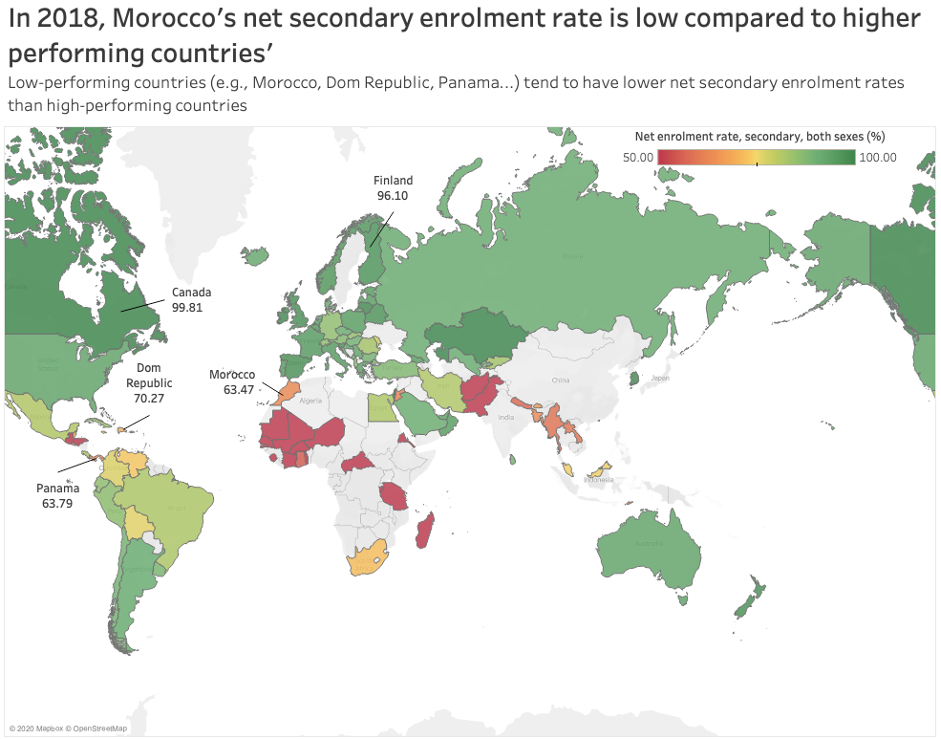

```{r, setup, include=FALSE}
knitr::opts_chunk$set(
  message = FALSE, 
  warning = FALSE, 
  tidy=FALSE,     # display code as typed
  size="small")   # slightly smaller font for code
options(digits = 3)

# default figure size
knitr::opts_chunk$set(
  fig.width=20, 
  fig.height=20,
  fig.align = "center"
)
```


```{r libraries, include=FALSE}
#Load the corresponding libraries
library(tidyverse)
library(extrafont)
library(vroom)
library(ggtext)
library(gapminder)
library(ggrepel)
library(patchwork)
library(gghighlight)
library(skimr)
library(here)
library(plotly)
<<<<<<< HEAD
=======
library(xlsx)
>>>>>>> 600b63128833eca73037e250df714ec23095027f

#remotes::install_github("kjhealy/nycdogs")
library(nycdogs)
library(sf) # for geospatial visualisation

#Windows
#loadfonts(device="win")
#MAC
loadfonts(device="pdf")
```

# Map visualizations

```{r read in the data}
#Read in the data
userBasedData_raw <- read.csv(file="Morocco.csv",header=TRUE,na.strings=c("..","NA"))
```

The objective of this part of the code is to generate relevant map visualizations using R in combination with Tableau.

The first question we want to explore is: how is Morocco's performance compared to the rest of the world's? Does Morocco perform well or badly? We will base our investigation on the average PISA scores ( as average, we consider the average of mathematics, science and reading scores).

```{r Morocco PISA plots}
#Select relevant data for subsequent plots.
Morocco <- userBasedData_raw %>%

#Select data corresponding to X2018..YR2018.
select(Country.Name,Country.Code,Series,X2018..YR2018.)%>%
#Choose the relevant variables.
filter(Series %in% c("PISA: Mean performance on the science scale", "PISA: Mean performance on the reading scale","PISA: Mean performance on the mathematics scale","Youth literacy rate, population 15-24 years, both sexes (%)","GDP at market prices (current US$)	","GDP at market prices (current US$)","Government expenditure on education as % of GDP (%)","Adult literacy rate, population 15+ years, both sexes (%)"))

#Organise the data in a neater way using pivot_wider
Morocco1<-Morocco%>%
  pivot_wider(names_from=Series,values_from=X2018..YR2018.)

#Clean the data corresponding to PISA scores.
Morocco1_PISA<-Morocco1%>%
  #Get only existen non-na values, (i.e. filter out NA values)
  filter(!is.na(`PISA: Mean performance on the science scale`)&!is.na(`PISA: Mean performance on the reading scale`)&!is.na(`PISA: Mean performance on the mathematics scale`))%>%
  #Select PISA performance scores
  select(Country.Name,Country.Code,`PISA: Mean performance on the science scale`,`PISA: Mean performance on the reading scale`,`PISA: Mean performance on the mathematics scale`)%>%
  #Create a new variable Average PISA which is an average of the scores in science, maths and reading
  mutate(AVG_PISA=(`PISA: Mean performance on the science scale`+`PISA: Mean performance on the reading scale`+`PISA: Mean performance on the mathematics scale`)/3)

#Export the data corresponding to PISA scores to excel file.
# Need to load library(xlsx) 
#Uncomment if Excel file is needed
#write.xlsx(Morocco1_PISA, file = "Morocco_PISA.xlsx",
 #     sheetName = "MoroccoPisa", append = FALSE)

#Plot produced with Tableau using the previous Excel file
library(png)
library(grid)
<<<<<<< HEAD
img0<-readPNG('Ave_PISA_Morocco1.png')
=======
img0<-readPNG('Ave_PISA_Morocco.png')
>>>>>>> 600b63128833eca73037e250df714ec23095027f
grid.raster(img0)

```

On the map, we can see that Moroccans' average performance isn't good. As benchmarks against which we can compare Morocco's performance, we have highlighted worst and best performing countries, Dominican Republic and China, respectively. Morocco's average score is 367.9 compared to Dominican Republic's 334.1 and China's 579. 

After understanding Morocco's performance in comparison to the rest of the world, we want to further explore the variables that may contribute to the country's underperformance. Primary and secondary education are interesting variables to consider since people taking the PISA scores are young high school students (15  and 16 year old). 

<<<<<<< HEAD
Therefore, we're going to take a look at net enrolment in primary and secondary education and compare Morocco's numbers with the rest of the world's.
=======
Therefore, we're going to take a look at net enrolment in primary and secondary education and compare Morocco's numbers with the rest of the world.
>>>>>>> 600b63128833eca73037e250df714ec23095027f


```{r Morocco primary education,fig.height=10,fig.width=10}

#Raw data corresponding to primary, secondary education enrolment 
primary_secondary_raw<-read.csv(file="primary_secondary.csv",header=TRUE,na.strings=c("..","NA"))

#PRIMARY NET ENROLMENT

# Select and filter to obtain the relevant data 
primary <- primary_secondary_raw %>%
  select(Country.Name,Country.Code,Series,`X2018..YR2018.`) %>%
  #Filter out NA values
   filter(!is.na(X2018..YR2018.)) %>%
 #Choose only data corresponding to primary net enrolment rate
 filter(Series %in% c("Net enrolment rate, primary, both sexes (%)"))%>%
  pivot_wider(names_from=Series,values_from=X2018..YR2018.)

 # Export the relevant data to file Morocco_net_primary1.xlsx
# (Uncomment if excel file is needed)

# write.xlsx(primary, file = "Morocco_net_primary1.xlsx",
      # sheetName = "Morocco_net_primary1", append = FALSE)
#Plot produced with Tableau using the previous Excel file
<<<<<<< HEAD
img2<-readPNG('Net_Primary_Morocco1.png')
=======
img2<-readPNG('Net_Primary_Morocco.png')
>>>>>>> 600b63128833eca73037e250df714ec23095027f
grid.raster(img2)

```
This map tells us how Morocco's net primary enrolment rate compares to other countries'. We can observe that Morocco has a high net primary enrolment rate, comparable to high-performing countries'. This indicates that the key to the Morocco's underperformance in PISA tests is not linked to primary education enrolment rates. Let's investigate net secondary enrolment rates!

```{r Morocco secondary education}
#SECONDARY NET ENROLMENT 

# Select and filter to obtain the relevant data 
primary_secondary <- primary_secondary_raw %>%
  #Select the relevant data variables
  select(Country.Name,Country.Code,Series,`X2018..YR2018.`) %>%
  #Filter out NA values
   filter(!is.na(X2018..YR2018.)) %>%
  #Choose only data corresponding to secondary net enrolment rate
 filter(Series %in% c("Net enrolment rate, secondary, both sexes (%)"))%>%
  pivot_wider(names_from=Series,values_from=X2018..YR2018.)

# Export the relevant data to file Morocco_net_secondary1.xlsx
# Uncomment if Excel file is needed

# write.xlsx(primary_secondary, file = "Morocco_net_secondary1.xlsx",
      # sheetName = "Morocco_net_secondary1", append = FALSE)

#Plot produced with Tableau using the previous Excel file
#
<<<<<<< HEAD
img1<-readPNG('Net_Secondary_Morocco1.png')
=======
img1<-readPNG('Net_Secondary_Morocco.png')
>>>>>>> 600b63128833eca73037e250df714ec23095027f
grid.raster(img1)
```
On the map, we can observe the world countries' net secondary enrolment rate. Particularly, we can see that Morocco has a low net secondary enrolment rate of only 63.47%. Some other low-performing countries such as Dominican Republic and Panama also have low enrolment rates. In contrast, high-performing countries such as Canada and Finland have very high net secondary enrolment rates, close to 100%. 

We can conclude that, unlike net primary enrolment rate, net secondary enrolment rate is generally different for high and low performing countries: countries that performed badly tend to have a significantly lower net secondary enrolment rate than countries that performed well. 


