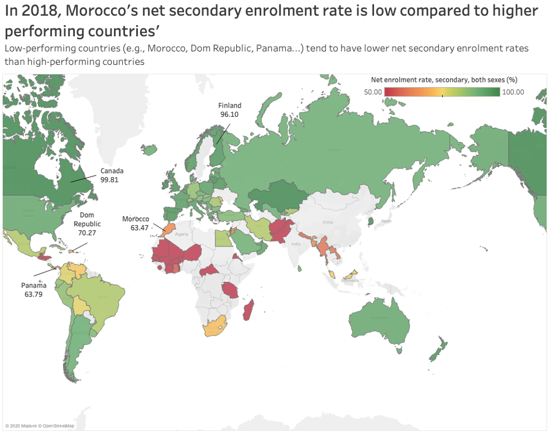

```{r,echo=FALSE}

knitr::opts_chunk$set(
  fig.width=8, 
  fig.height=7,
  fig.align = "center",
  echo = TRUE
)
```

```{r setup, include=FALSE}

library(tidyverse)
library(readr)
library(janitor)
library(lubridate)
library(scales)
library(extrafont)
library(vroom)
library(ggtext)
library(gapminder)
library(ggrepel)
library(patchwork)
library(gghighlight)
library(skimr)
library(here)
library(plotly)
#remotes::install_github("kjhealy/nycdogs")
library(nycdogs)
library(sf) # for geospatial visualisation
library(countrycode)


```

```{r,results="hide",echo=FALSE,warning=FALSE,message=FALSE}

datavis <- read_csv("Datavis.csv")

```

# Introduction

> During my life in Morocco, I have always been told how great of a nation we were in all aspects. Education was one of them, and one common standard was to depict us as excellent in mathematics, without any real proof of that.
Until recently, this is the first result that you could find on Internet while typing "Moroccans are good at mathematics". We excel, how wonderful is this!


> However, growing up, I realized that the poverty I was surrounded by depicted a deep-rooted defect in education. In 2018, the OECD proposed Morocco to take the PISA test, which measures 15-year-olds' ability to use their reading, mathematics and science knowledge to meet real-life challenges.This is what happened:


> The result is clear : "PISA : Moroccan students have poor reading, Math, Science abilities". This picture shows that data can radically transform the paradigms and beliefs underlying a whole education system. It is time for Morocco to adopt a data-driven approach to solve institutional problems, especially in education. We need to fix our system's chronic dysfunctions because they result in an exorbitant cost that the country bears in setting up its education system and an uncertain future for learners.


>We need to visualize data in a truthful and enlightening way (Alberto Cairo's principles) in order to get out of this collective blindness. Let us understand where we truly stand.

# Literacy rate

## The big picture

>First, we start with the most basic indicator of a country's education : Literacy Rate.

```{r,warning=FALSE,message=FALSE,results="hide",echo= FALSE}

#Clean names
datavis <- datavis %>% clean_names()

#Change the literacy rate from character to numeric for all categories (adult, youth, elderly) and sexes
datavis_dbl <- datavis %>%
  mutate(adult_literacy_rate_population_15_years_both_sexes_percent_se_adt_litr_zs = as.numeric(adult_literacy_rate_population_15_years_both_sexes_percent_se_adt_litr_zs),
         	
adult_literacy_rate_population_15_years_female_percent_se_adt_litr_fe_zs = as.numeric(	
adult_literacy_rate_population_15_years_female_percent_se_adt_litr_fe_zs),
adult_literacy_rate_population_15_years_male_percent_se_adt_litr_ma_zs = as.numeric(adult_literacy_rate_population_15_years_male_percent_se_adt_litr_ma_zs),
elderly_literacy_rate_population_65_years_both_sexes_percent_uis_lr_ag65 = as.numeric(elderly_literacy_rate_population_65_years_both_sexes_percent_uis_lr_ag65
),
elderly_literacy_rate_population_65_years_female_percent_uis_lr_ag65_f = as.numeric(elderly_literacy_rate_population_65_years_female_percent_uis_lr_ag65_f
),
elderly_literacy_rate_population_65_years_male_percent_uis_lr_ag65_m = as.numeric(elderly_literacy_rate_population_65_years_male_percent_uis_lr_ag65_m),
youth_literacy_rate_population_15_24_years_both_sexes_percent_se_adt_1524_lt_zs = as.numeric(youth_literacy_rate_population_15_24_years_both_sexes_percent_se_adt_1524_lt_zs),
youth_literacy_rate_population_15_24_years_female_percent_se_adt_1524_lt_fe_zs = as.numeric(youth_literacy_rate_population_15_24_years_female_percent_se_adt_1524_lt_fe_zs
),
youth_literacy_rate_population_15_24_years_male_percent_se_adt_1524_lt_ma_zs = as.numeric(youth_literacy_rate_population_15_24_years_male_percent_se_adt_1524_lt_ma_zs
) )


#I filter for Morocco
datavis_morocco <- datavis_dbl %>%
  filter(country_name == "Morocco")

#I filter for 2018 only
datavis_morocco_recent <- datavis_morocco %>%
  filter(time == 2018)

#Mean literacy rate worldwide. Since some countries have NA values, there is a small error
mean_literacy_worldwide <- datavis_dbl %>%
  filter(time == 2018) %>%
  na.omit(adult_literacy_rate_population_15_years_both_sexes_percent_se_adt_litr_zs) %>%
  summarize(mean(adult_literacy_rate_population_15_years_both_sexes_percent_se_adt_litr_zs))

#I add the true literacy rate worldwide to correct for the small error found earlier
datavis_morocco_recent %>%
  mutate(worldwide_literacy_rate = 86.3) %>%
  mutate(adult_literacy_rate_population_15_years_both_sexes_percent_se_adt_litr_zs = as.numeric(adult_literacy_rate_population_15_years_both_sexes_percent_se_adt_litr_zs))


```


```{r,warning=FALSE,message=FALSE,echo=FALSE}

#I create a dataframe for my first visualization 
region <- c('Morocco','World')
adult_literacy_rate <- c(0.7375,0.863)
first_plot_df <- data.frame(region,adult_literacy_rate)

#First plot : literacy rate Morocco vs worldwide
ggplot(first_plot_df, aes(x=region,y=adult_literacy_rate,fill=region)) + geom_col() +
  labs(title = "Morocco is far behind the rest of the world",subtitle ="Adult literacy rate Worldwide vs Morocco", x= "Region", y = "Adult literacy rate", caption = "Source : worldbank.org/education") + 
  theme_minimal() + 
  geom_text(label= percent(adult_literacy_rate),vjust = -1.5, family = "Oswald", size=4) +
  scale_fill_manual(values = c("#C0392B","#D5F5E3")) + 
  theme(plot.title = element_text(face = "bold", size = 19, family = "Oswald"),
      legend.title = element_text(family = "Oswald"),
      legend.position = 'none',
      plot.subtitle=element_text(size=17, family = "Oswald"),
      plot.caption = element_text(size=9 , family = "Oswald"),
      axis.text.x = element_text(size= 11, family='Oswald',color="black"),
      axis.text.y = element_text(size= 11,family = "Oswald",color="black"),
      axis.title.x = element_text(size= 11, family='Oswald',color="black"),
      axis.title.y = element_text(size= 11,family = "Oswald",color="black"),plot.title.position = "plot",
       plot.caption.position = "plot",
       panel.grid.minor=element_blank()) + scale_y_continuous(labels = scales::percent, limits=c(0,1))

```

> It is clear that Morocco is far behind the rest of the world. But is the situation really bad? Are the means allocated to increasing the literacy rate sufficient?

## Zoom on generations

```{r,warning=FALSE,message=FALSE,echo=FALSE}

#I read a dataframe made on excel
second_plot_df <- read_csv("data_second_plot.csv")

#I create a label for my plot
label = "30% gap"

#Second plot : literacy rate Morocco vs worldwide
ggplot(second_plot_df, aes(x=age_group,y=literacy_rate,fill=Gender)) + geom_col(position = "dodge") +
  ylim(0,100)+ 
  labs(title = "The youth rises!",subtitle ="Youth (15+) literacy rate vs Elderly (65+) literacy rate per gender", x= "", y = "Literacy rate", caption = "Source : worldbank.org/education") + 
  theme_minimal()  +  scale_fill_manual(values = c("#9AD3FA","#FA9ACE")) +
  theme(plot.title = element_text(face = "bold", size = 19, family = "Oswald"),
      legend.title = element_text(family = "Oswald"),
      plot.subtitle=element_text(size=17, family = "Oswald"),
      plot.caption = element_text(size=9 , family = "Oswald"),
      axis.text.x = element_text(size= 11, family='Oswald',color="black"),
      axis.text.y = element_text(size= 11,family = "Oswald",color="black"),
      axis.title.x = element_text(size= 11, family='Oswald',color="black"),
      axis.title.y = element_text(size= 11,family = "Oswald",color="black"),plot.title.position = "plot",
       plot.caption.position = "plot",
       panel.grid.minor=element_blank()) + scale_y_continuous(labels = function(x) paste0(x, "%")) +

    geom_curve(
    data = data.frame(x = 1.3, y = 21, xend = 1.05, yend = 50),
    mapping = aes(x = x, y = y, xend = xend, yend = yend),
    colour = "grey15",
    size = 0.5,
    curvature = 0.2,
    arrow = arrow(length = unit(2, "mm"), type = "closed"),
    inherit.aes = FALSE) +
   
   geom_text(
    data = data.frame(x = 1, y = 65, label = label),
    aes(x = x, y = y, label = label),
    colour="#AE0E24",
    family="Oswald",
    size= 6,
    hjust = 0.5,
    lineheight = .8,
    inherit.aes = FALSE)


```
> The picture is now clearer : Morocco's literacy rate is driven down by the older generation. This generation was indeed rural based and had less access to schools. Moreover, Morocco's education was mainly based on Quran (read by professors) rather than academic programs such as we know them today.We also notice a drastic reduction in gender gap, which further proves that the situation of literacy rate in Morocco is actually improving a lot more than we initially thought!


## Understand the country's evolution

> How did we reach this point? Why is the youth literacy rate so high today?
 

```{r,warning=FALSE,message=FALSE,echo=FALSE}
#Third visualization
#Read small dataset with corrected data
third_vis <- read_csv("third vis.csv")

#Change time to date format
third_vis <- third_vis %>% mutate(time = mdy(time)) 

#Add a new variable that represents the completion rate of students as a % of that age population. This is done by multiplying the primary completion rate by the net enrolment in primary school.
#Add a difference column between the new primary completion rate and the net enrolment
#pivot longer net enrolment and the new variable to make my plot
third_vis_pivot <- third_vis %>%  mutate(primary_completion_rate_new = net_enrolment_rate_primary*0.01* primary_completion_rate)%>%
  mutate(difference = net_enrolment_rate_primary - primary_completion_rate_new) %>%
  mutate(net_enrolment_rate_primary_new = net_enrolment_rate_primary-difference)  %>%
  pivot_longer(cols = "difference":"net_enrolment_rate_primary_new",names_to = "index",values_to = "rate")


#I create labels for my plot
label2 <- "Education reform"
label3 <- "Lower secondary school drop-out rate"


#I create my plot
ggplot(data= third_vis_pivot) + geom_area(aes(x=time,y=rate,fill=index)) + geom_area(aes(x=time,y=rate,fill=index)) + geom_line(aes(x=time,y=cumulative_drop_out_rate_lower_education),colour="#FFFFFF") + theme_minimal() +
  labs(title = "Moroccan kids complete primary school..",subtitle ="..But they drop out in secondary school ", x= "Year", y = "% rate", caption = "Source : worldbank.org/education", fill = "") + 
  theme_minimal()  +  scale_fill_manual(values = c("#9AD3FA","36D173"),labels = c("Net enrolment rate in primary school","Completion rate in primary school")) +
  theme(plot.title = element_text(face = "bold", size = 19, family = "Oswald"),
      legend.title = element_text(family = "Oswald"),
      legend.text = element_text(family = "Oswald",size=10),
      plot.subtitle=element_text(size=17, family = "Oswald"),
      plot.caption = element_text(size=9 , family = "Oswald"),
      axis.text.x = element_text(size= 11, family='Oswald',color="black"),
      axis.text.y = element_text(size= 11,family = "Oswald",color="black"),
      axis.title.x = element_text(size= 11, family='Oswald',color="black"),
      axis.title.y = element_text(size= 11,family = "Oswald",color="black"),plot.title.position = "plot",
       plot.caption.position = "plot",
      panel.grid.minor=element_blank()) +  scale_y_continuous(labels = function(x) paste0(x, "%")) + 
    geom_curve(
    data = data.frame(x = dmy("01-01-1984"), y = 80, xend = dmy("01-01-1984"), yend = 65),
    mapping = aes(x = x, y = y, xend = xend, yend = yend),
    colour = "grey15",
    size = 0.2,
    curvature = 0,
    arrow = arrow(length = unit(2, "mm"), type = "closed"),
    inherit.aes = FALSE) +
   
   geom_text(
    data = data.frame(x = dmy("01-01-1984"), y = 85, label = label2),
    aes(x = x, y = y, label = label),
    colour="black",
    family="Oswald",
    size= 4.5,
    hjust = 0.5,
    lineheight = .8,
    inherit.aes = FALSE) +
  
   geom_text(
    data = data.frame(x = dmy("01-01-1995"), y = 7, label = label3),
    aes(x = x, y = y, label = label),
    colour="#FFFFFF",
    family="Oswald",
    size= 3.5,
    hjust = 0.5,
    lineheight = .8,
    inherit.aes = FALSE)


```

Before diving too much into details, let us recall a few facts and definitions :
+ Primary school: Age 6 to 11
+ Lower secondary school : Age 12 to 15

* Net enrolment rate in primary school : The number of pupils of official primary school age who are enrolled in primary education as a percentage of the total children of the official school age population

* Completion rate in primary school : The proportion of enrolled primary school pupils that complete primary school.

* Lower secondary school drop-out rate : The cumulative drop-out rate until the last grade of lower secondary school.

> Net enrolment rate and completion rate for primary schools have sharply increased since 1970. The main decrease happened in 1987, when the minister of education Dr.Azzedine Laraki imposed the arabization and islamization of academic programs. Furthermore, King Hassan II ordered to remove philosophy and sociology from all programs in order to better control population. This had an abrupt effect on primary school enrolment and completion rate, but the situation came back to normal in the early 1990's. Nearly all kids are now enrolled in primary school and complete it, which explains why the youth literacy rate is so high compared to the older generation.

> The lower secondary school drop-out rate has not improved at all during the last 40 years. Moroccan 15 years old students know how to read and write since they went to primary school. However, can they use their abilities to meet real-life challenges? How well can they use their reading,science and mathematics skills in real settings? This is exactly what the Programme for International Student Assessment (PISA) tests for. 

# PISA scores

##Histogram


```{r,warning=FALSE,message=FALSE,echo=FALSE}

#PISA

#I filter 2018 only
#I change PISA scores as numeric variables
datavis_recent_dbl <- datavis_dbl %>%
  filter(time == 2018) %>%
  mutate(pisa_mean_performance_on_the_science_scale_lo_pisa_sci = as.numeric(pisa_mean_performance_on_the_science_scale_lo_pisa_sci),
pisa_mean_performance_on_the_reading_scale_lo_pisa_rea = as.numeric(pisa_mean_performance_on_the_reading_scale_lo_pisa_rea),
pisa_mean_performance_on_the_mathematics_scale_lo_pisa_mat = as.numeric(pisa_mean_performance_on_the_mathematics_scale_lo_pisa_mat))

#I only select the necessary columns 
#I add a column that filters for Morocco in order to group by in further steps
datavis_recent_dbl <- datavis_recent_dbl  %>%
  select(c(pisa_mean_performance_on_the_science_scale_lo_pisa_sci,pisa_mean_performance_on_the_reading_scale_lo_pisa_rea,pisa_mean_performance_on_the_mathematics_scale_lo_pisa_mat,country_name)) %>%
  mutate(is_morocco = ifelse(country_name == "Morocco","Morocco","World"))


#I calculate the average for Morocco and for the world
datavis_recent_dbl <- datavis_recent_dbl %>% na.omit() %>%
  group_by(is_morocco) %>%
  summarize(Science = mean(pisa_mean_performance_on_the_science_scale_lo_pisa_sci,na.rm=TRUE), Mathematics= mean(pisa_mean_performance_on_the_mathematics_scale_lo_pisa_mat,na.rm=TRUE), Reading = mean(pisa_mean_performance_on_the_reading_scale_lo_pisa_rea,na.rm=TRUE))


#I pivot longer the test scores
datavis_recent_dbl <- datavis_recent_dbl %>%
  pivot_longer(cols = "Science":"Reading",names_to = "mean_per_subject",values_to = "score")

#I create labels for my plot
label4 <- "22% gap"
label5 <- "25% gap"
label6 <- "27% gap"
  
#I can now create my plot
ggplot(datavis_recent_dbl, aes(x= mean_per_subject,y=score,fill=is_morocco)) + geom_col(position = "dodge") + ylim(0,600) + theme_minimal() +
  labs(title = "Morocco underperforms on all PISA subjects",subtitle ="Mean PISA score per subject", y = "PISA scores", caption = "Source : worldbank.org/education", fill= "Region") + 
  theme_minimal()  +  
  scale_fill_manual(values = c("#C0392B","#D5F5E3")) +
  theme(plot.title = element_text(face = "bold", size = 19, family = "Oswald"),
      legend.title = element_text(family = "Oswald"),
      plot.subtitle=element_text(size=17, family = "Oswald"),
      plot.caption = element_text(size=9 , family = "Oswald"),
      axis.text.x = element_text(size= 11, family='Oswald',color="black"),
      axis.text.y = element_text(size= 11,family = "Oswald",color="black"),
      axis.title.x = element_blank(),
      axis.title.y = element_text(size= 11,family = "Oswald",color="black"),plot.title.position = "plot",
       plot.caption.position = "plot",
      panel.grid.minor=element_blank())+
  
  geom_text(
    data = data.frame(x = "Science", y = 530, label = label4),
    aes(x = x, y = y, label = label),
    colour="#AE0E24",
    family="Oswald",
    size= 4.5,
    hjust = 0.5,
    lineheight = .8,
    inherit.aes = FALSE) +
   
   geom_text(
    data = data.frame(x = "Mathematics", y = 530, label = label5),
    aes(x = x, y = y, label = label),
    colour="#AE0E24",
    family="Oswald",
    size= 4.5,
    hjust = 0.5,
    lineheight = .8,
    inherit.aes = FALSE) +
  
   geom_text(
    data = data.frame(x = "Reading", y = 530, label = label6),
    aes(x = x, y = y, label = label),
    colour="#AE0E24",
    family="Oswald",
    size= 4.5,
    hjust = 0.5,
    lineheight = .8,
    inherit.aes = FALSE)


```

> The high youth literacy rate is very positive, but it is clearly not enough to assert that Morocco's educational system is great. The country underperforms on all PISA subjects compared to the rest of the world, indicating that even though 15 years old students are literate, they still struggle to use their skills to meet real-life challenges because too many of them have dropped out before the last year of lower secondary school.

## Map visualization


```{r read in the data}
#Read in the data
userBasedData_raw <- read.csv(file="Morocco.csv",header=TRUE,na.strings=c("..","NA"))
```

The objective of this part of the code is to generate relevant map visualizations using R in combination with Tableau.

The first question we want to explore is: how is Morocco's performance compared to the rest of the world's? Does Morocco perform well or badly? We will base our investigation on the average PISA scores ( as average, we consider the average of mathematics, science and reading scores).

```{r Morocco PISA plots}
#Select relevant data for subsequent plots.
Morocco <- userBasedData_raw %>%

#Select data corresponding to X2018..YR2018.
select(Country.Name,Country.Code,Series,X2018..YR2018.)%>%
#Choose the relevant variables.
filter(Series %in% c("PISA: Mean performance on the science scale", "PISA: Mean performance on the reading scale","PISA: Mean performance on the mathematics scale","Youth literacy rate, population 15-24 years, both sexes (%)","GDP at market prices (current US$)	","GDP at market prices (current US$)","Government expenditure on education as % of GDP (%)","Adult literacy rate, population 15+ years, both sexes (%)"))

#Organise the data in a neater way using pivot_wider
Morocco1<-Morocco%>%
  pivot_wider(names_from=Series,values_from=X2018..YR2018.)

#Clean the data corresponding to PISA scores.
Morocco1_PISA<-Morocco1%>%
  #Get only existen non-na values, (i.e. filter out NA values)
  filter(!is.na(`PISA: Mean performance on the science scale`)&!is.na(`PISA: Mean performance on the reading scale`)&!is.na(`PISA: Mean performance on the mathematics scale`))%>%
  #Select PISA performance scores
  select(Country.Name,Country.Code,`PISA: Mean performance on the science scale`,`PISA: Mean performance on the reading scale`,`PISA: Mean performance on the mathematics scale`)%>%
  #Create a new variable Average PISA which is an average of the scores in science, maths and reading
  mutate(AVG_PISA=(`PISA: Mean performance on the science scale`+`PISA: Mean performance on the reading scale`+`PISA: Mean performance on the mathematics scale`)/3)

#Export the data corresponding to PISA scores to excel file.
# Need to load library(xlsx) 
#Uncomment if Excel file is needed
#write.xlsx(Morocco1_PISA, file = "Morocco_PISA.xlsx",
 #     sheetName = "MoroccoPisa", append = FALSE)

#Plot produced with Tableau using the previous Excel file
library(png)
library(grid)
img0<-readPNG('Ave_PISA_Morocco1.png')
grid.raster(img0)

```

On the map, we can see that Moroccans' average performance isn't good. As benchmarks against which we can compare Morocco's performance, we have highlighted worst and best performing countries, Dominican Republic and China, respectively. Morocco's average score is 367.9 compared to Dominican Republic's 334.1 and China's 579. 

After understanding Morocco's performance in comparison to the rest of the world, we want to further explore the variables that may contribute to the country's underperformance. Primary and secondary education are interesting variables to consider since people taking the PISA scores are young high school students (15  and 16 year old). 

Therefore, we're going to take a look at net enrolment in primary and secondary education and compare Morocco's numbers with the rest of the world's.


```{r Morocco primary education,fig.height=10,fig.width=10}

#Raw data corresponding to primary, secondary education enrolment 
primary_secondary_raw<-read.csv(file="primary_secondary.csv",header=TRUE,na.strings=c("..","NA"))

#PRIMARY NET ENROLMENT

# Select and filter to obtain the relevant data 
primary <- primary_secondary_raw %>%
  select(Country.Name,Country.Code,Series,`X2018..YR2018.`) %>%
  #Filter out NA values
   filter(!is.na(X2018..YR2018.)) %>%
 #Choose only data corresponding to primary net enrolment rate
 filter(Series %in% c("Net enrolment rate, primary, both sexes (%)"))%>%
  pivot_wider(names_from=Series,values_from=X2018..YR2018.)

 # Export the relevant data to file Morocco_net_primary1.xlsx
# (Uncomment if excel file is needed)

# write.xlsx(primary, file = "Morocco_net_primary1.xlsx",
      # sheetName = "Morocco_net_primary1", append = FALSE)
#Plot produced with Tableau using the previous Excel file
img2<-readPNG('Net_Primary_Morocco1.png')
grid.raster(img2)

```
This map tells us how Morocco's net primary enrolment rate compares to other countries'. We can observe that Morocco has a high net primary enrolment rate, comparable to high-performing countries'. This indicates that the key to the Morocco's underperformance in PISA tests is not linked to primary education enrolment rates. Let's investigate net secondary enrolment rates!

```{r Morocco secondary education}
#SECONDARY NET ENROLMENT 

# Select and filter to obtain the relevant data 
primary_secondary <- primary_secondary_raw %>%
  #Select the relevant data variables
  select(Country.Name,Country.Code,Series,`X2018..YR2018.`) %>%
  #Filter out NA values
   filter(!is.na(X2018..YR2018.)) %>%
  #Choose only data corresponding to secondary net enrolment rate
 filter(Series %in% c("Net enrolment rate, secondary, both sexes (%)"))%>%
  pivot_wider(names_from=Series,values_from=X2018..YR2018.)

# Export the relevant data to file Morocco_net_secondary1.xlsx
# Uncomment if Excel file is needed

# write.xlsx(primary_secondary, file = "Morocco_net_secondary1.xlsx",
      # sheetName = "Morocco_net_secondary1", append = FALSE)

#Plot produced with Tableau using the previous Excel file
#
img1<-readPNG('Net_Secondary_Morocco1.png')
grid.raster(img1)
```
On the map, we can observe the world countries' net secondary enrolment rate. Particularly, we can see that Morocco has a low net secondary enrolment rate of only 63.47%. Some other low-performing countries such as Dominican Republic and Panama also have low enrolment rates. In contrast, high-performing countries such as Canada and Finland have very high net secondary enrolment rates, close to 100%. 

We can conclude that, unlike net primary enrolment rate, net secondary enrolment rate is generally different for high and low performing countries: countries that performed badly tend to have a significantly lower net secondary enrolment rate than countries that performed well. 


-- PROUD AND JIEYI -- 


```{r, warning = FALSE}
data1 <- read.csv("dataviz_cleanname.csv")

# add continent information
data1$continent <- countrycode(sourcevar = data1$country,
                               origin = "country.name",
                               destination = "continent")

# change variables types to numeric
data1[6:146] <- lapply(data1[6:146], as.numeric)
```

# Plot1
```{r , warning=FALSE, fig.width=9}
title <- "Beyond a GDP per capita of $2500, GDP is not a major driver of youth literacy"

# create clean data for youth literacy rate and gdp
young_lt_vs_gdp <- data1 %>% 
  select(country,time,
         youth_literacy_rate_population_15_24_years_both_sexes_se_adt_1524_lt_zs,
         gdp_per_capita_current_us_ny_gdp_pcap_cd) %>% 
  # delete missing values
  filter(youth_literacy_rate_population_15_24_years_both_sexes_se_adt_1524_lt_zs != "..") %>% 
  # use the latest number for each country
  group_by(country) %>% 
  slice_max(order_by = time, n = 1) %>% 
  # Some of the latest number are before 2010, delete them
  filter(time > 2010) %>% 
  # set arrange for GDP per capita
  filter(gdp_per_capita_current_us_ny_gdp_pcap_cd > 1000 &
         gdp_per_capita_current_us_ny_gdp_pcap_cd < 30000) %>% 
  # create new variables to point Morocco out
  mutate(Morocco_or_not = case_when(
    country == "Morocco" ~ "Y",
    TRUE ~ "N"))


#create a plot
young_lt_vs_gdp %>% 
  ggplot(aes(x = gdp_per_capita_current_us_ny_gdp_pcap_cd, 
             y = youth_literacy_rate_population_15_24_years_both_sexes_se_adt_1524_lt_zs, color = Morocco_or_not))+
  geom_point(stat = "identity") +
  # add a vline to emphasize our idea
  geom_vline(xintercept = 2560, linetype = "dashed", color = "Orange", size = 1)+
  
  scale_x_continuous(breaks=seq(0,20000,by=5000), limits=c(0,15000)) +
  
  
  #add titles and subtitles
  labs(title = title,
       subtitle = "Scatterplot of youth literacy rate against GDP per capita",
       x = "GDP per capita", 
       y = "Youth Literacy Rate",
       caption = "Data source: Worldbank.org/education")+
  theme_minimal()+
  
  
  #set fonts and sizes for every text
  theme(plot.title = element_text(face = "bold", size = 19, family = "Oswald"),
      plot.subtitle=element_text(size=17, family = "Oswald"),
      plot.caption = element_text(size=9 , family = "Oswald"),
      legend.position= "none",
      axis.text.x = element_text(size= 11, family='Oswald',color="black"),
      axis.text.y = element_text(size= 11,family = "Oswald",color="black"),
      axis.title.x = element_text(size= 11, family='Oswald'),
      axis.title.y = element_text(size= 11, family='Oswald'),
      plot.title.position = "plot")+
  scale_color_manual(values = c("grey","red")) +
  theme(legend.position = "none")+
  
  
   #add annodate for Morroco
  geom_text(data = data.frame(x = 3500, y = 96, label = "Morocco"),
    aes(x = x, y = y, label = label),
    colour="red",
    family="Oswald",
    size = 4,
    hjust = 0.5,
    lineheight = .8,
    inherit.aes = FALSE)
```
Unexpectedly, there isnt a 1-1 linear relationship between GDP per capita and Youth literacy rate. We can we see that there is a sharp increase in literacy rate when the GDP per capita increases up to $2500, this already leads to an almost 100% literacy rate already. We believe that this could be due to the easier accessibility to technology and learning materials, so it would be expected that there is a high youth literacy nowadays. Henceforth, youth literacy rate might not be a good indicator of overall literacy. 

# Plot 2
```{r}
# calculate pisa mean
pisa_mean <- data1 %>% 
  select(country, time,
         pisa_mean_performance_on_the_mathematics_scale_lo_pisa_mat,
         pisa_mean_performance_on_the_reading_scale_lo_pisa_rea,
         pisa_mean_performance_on_the_science_scale_lo_pisa_sci) %>% 
  group_by(country, time) %>% 
  mutate(mean_score = sum(pisa_mean_performance_on_the_reading_scale_lo_pisa_rea,
                              pisa_mean_performance_on_the_mathematics_scale_lo_pisa_mat,
                              pisa_mean_performance_on_the_science_scale_lo_pisa_sci)/3) %>% 
  filter(!is.na(mean_score)) %>% 
  select(country,time,mean_score) %>% 
  group_by(country) %>% 
  slice_max(order_by = time, n = 1)

# process the net enrolment rate data
ST_ratio <- data1 %>% 
  select(country, time,
         net_enrolment_rate_lower_secondary_both_sexes_uis_ner_2) %>% 
  filter(!is.na(net_enrolment_rate_lower_secondary_both_sexes_uis_ner_2))%>% 
  group_by(country) %>% 
  slice_max(order_by = time, n = 1)

# join two chart together
st_pisa <- pisa_mean %>% 
  left_join(ST_ratio, by = c("country" = "country")) %>% 
  filter(!is.na(net_enrolment_rate_lower_secondary_both_sexes_uis_ner_2)) %>% 
  mutate(Morocco = case_when(
    country == "Morocco" ~ "Y",
    TRUE ~ "N"
  ))
```


```{r , warning=FALSE, fig.width=9}
# create the plot
st_pisa %>% 
  ggplot(aes(x = net_enrolment_rate_lower_secondary_both_sexes_uis_ner_2,
             y = mean_score, color = Morocco))+
  geom_point()+
  geom_smooth(method="lm",se=FALSE, color = "darkblue")+
  annotate("text",x = 60, y = 385, label = "Morocco", color = "red", font = "Oswald" )+
  theme_minimal()+
  
  labs(title = "Only if students go to school they can actually become more educated",
       subtitle = "PISA scores as a means of secondary education enrollment",
    y = "Mean PISA Score", x = "Net Enrolment Rate for Secondary Education",
    caption = "\nNote: Net Enrollment Rate = DEFINITION \n\nData source: Worldbank.org/education")+
  
  theme(plot.title = element_text(face = "bold", size = 19, family = "Oswald"),
      plot.subtitle=element_text(size=17, family = "Oswald"),
      plot.caption = element_text(size=9 , family = "Oswald"),
      legend.position= "none",
      axis.text.x = element_text(size= 11, family='Oswald',color="black"),
      axis.text.y = element_text(size= 11,family = "Oswald",color="black"),
      axis.title.x = element_text(size= 11, family='Oswald'),
      axis.title.y = element_text(size= 11, family='Oswald'),
      plot.title.position = "plot")+
  scale_color_manual(values = c("grey","red")) +
  theme(legend.position = "none")

```

> When looking at PISA score and net enrollment for secondary education, Morocco is at the end of the spectrum when compared to the whole world. Secondary education seems to have much of a greater impact on the pupil's ability to do well in the PISA test - mathematics, science and reading abilities. Secondary school capabilities is directly related to the PISA score because the test takers are in the 15 year old range children. As a result, Morocco should have to try and boost their net enrollment rate in secondary education on the first stage to improvement in PISA scores. We decided to include the healthcare data into our report because we have realised that the country's healthcare system has an influence on students staying in school and going to school on a regular basis. It would be as simple as having vaccines for the influenza season because there has been a study saying that for every 100 children during flu season, which included 37 school days, an excess of 28 illness episodes and 63 missed school days occured. However, we can see that for Vietnam, they spend much less in healthcare which could be because, their neighbouring countries like Thailand and Phillipines has very good healthcare so they could just cross the border to access them. But for the case of Morocco, this does not exist. So looking at a similar country landscape like Belarus, to attend a higher PISA score like them, Morocco must improve their healthcare system.


-- KEN -- 

```{r, fig.width = 10}

data <- read.csv("Datavis.csv") %>% 
  janitor::clean_names()
# head(data)#change name
# colnames(data)[1] <- "country"
# 
# #select time
# data1 <- data %>% 
#   select(country:series_code,x2000_yr2000:x2020_yr2020)
# 
# #change names
# colnames(data1)[5:25] <- c(2000:2020)
# 
# #pivot longer
# data2 <- tidyr::pivot_longer(data1, cols = "2000":"2020", names_to = "Year", values_to = "count")

#set the missing data as NA
data[data == ".."] <- NA

#add continent information
# data2$continent <- countrycode(sourcevar = data2$country,
#                                origin = "country.name",
#                                destination = "continent")
# #data2 taken from clean_data_1
# data_clean <- data2 %>%
#   filter(series != "") %>% 
#     mutate(Year = as.integer(Year),
#          count = as.double(count)) %>% 
#     select(-series_code)

```

```{r}

data_clean <- data %>% 
  rename(country = i_country_name) %>% 
  mutate(year = as.integer(time),
         mean_read_score = as.integer(pisa_mean_performance_on_the_reading_scale_lo_pisa_rea),
         GDP_per_cap = as.double(gdp_per_capita_current_us_ny_gdp_pcap_cd),
         GDP_per_cap_PPP = as.double(gdp_per_capita_ppp_current_international_ny_gdp_pcap_pp_cd),
         mean_sci_score = as.integer(pisa_mean_performance_on_the_science_scale_lo_pisa_sci),
         mean_math_score = as.integer(pisa_mean_performance_on_the_mathematics_scale_lo_pisa_mat),
         mean_score = (mean_math_score + mean_sci_score + mean_read_score)/3)

pisa <- data_clean %>% 
  filter(time == '2018', country != 'Kosovo', !is.na(mean_read_score)) %>% 
  #only countries, with scores, Kosovo has no continent so remove the data
  mutate(highlight = ifelse(country %in% c("China", "Luxembourg", "Morocco", "Vietnam"), TRUE, FALSE),
         c_label = ifelse(country %in% c("China", "Luxembourg", "Morocco", "Vietnam"), country, ""))


```

```{r, fig.width = 10}

ggplot(pisa, aes(x = GDP_per_cap, y = mean_score, colour = highlight, label = c_label)) + 
  geom_point() +
  ggrepel::geom_text_repel() +
  labs(y = "Mean PISA Score", x = "GDP per Capita", 
       title = "Money can help improve education but it's not the only factor",
       subtitle = "China and Vietnam excel with low GDP per capita",
       caption = "Source : worldbank.org/education") +
  scale_colour_manual(values = c("grey","#C0392B")) +
  theme(plot.title = element_text(face = "bold", size = 19, family = "Oswald"),
      legend.title = element_text(family = "Oswald"),
      legend.position = 'none',
      plot.subtitle=element_text(size=17, family = "Oswald"),
      plot.caption = element_text(size=9 , family = "Oswald"),
      axis.text.x = element_text(size= 11, family='Oswald',color="black"),
      axis.text.y = element_text(size= 11,family = "Oswald",color="black"),
      axis.title.x = element_text(size= 11, family='Oswald',color="black"),
      axis.title.y = element_text(size= 11,family = "Oswald",color="black"),
      plot.title.position = "plot",
      plot.caption.position = "plot",
      panel.grid = element_blank(),
      panel.background = element_rect(fill = 'white', colour = 'white'),
      axis.ticks = element_blank())

  


```


> Above we can see that while GDP per capita clearly plays a role in the PISA scores, it appears there are other factors that influence the outcome. We can see certain countries such as Vietnam (which has a similar GDP per capita to Morocco) has exceptional outcomes. The same is true for China which is highly successful given their GDP per capita. On the flipside we have Luxembourg who perform worse than almost all countries with over 35000 GDP per capita. It is clear there are other strong factors that play a role in the educational outcomes of each country.

```{r pressure, echo=FALSE}
#These are horrible variables so tried to name them something reasonable
model_data <- data_clean %>% 
  mutate(lit_rate = as.double(adult_literacy_rate_population_15_years_both_sexes_se_adt_litr_zs),
         pri_enrolment_rate = as.double(net_enrolment_rate_primary_both_sexes_se_prm_nenr),
         sec_enrolment_rate = as.double(net_enrolment_rate_secondary_both_sexes_se_sec_nenr),
         lower_sec_enrolment_rate = as.double(net_enrolment_rate_lower_secondary_both_sexes_uis_ner_2),
         drop_out_rate = as.double(cumulative_drop_out_rate_to_the_last_grade_of_lower_secondary_general_education_both_sexes_uis_dr_2_gpv_t),
         early_ed_rate = as.double(net_enrolment_rate_pre_primary_both_sexes_se_pre_nenr)) %>% 
  select(country, 
         year,
         mean_read_score,
         GDP_per_cap,
         lit_rate,
         pri_enrolment_rate,
         sec_enrolment_rate,
         lower_sec_enrolment_rate,
         drop_out_rate,
         early_ed_rate                                                  ,
         ) %>% 
  filter(year >2000, !is.na(mean_read_score))


model1 <- lm(mean_read_score ~ GDP_per_cap + early_ed_rate + lower_sec_enrolment_rate , model_data)
summary(model1)
```


  